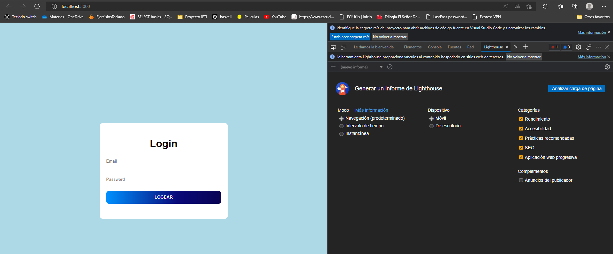

# CodeLab

## Part 1: VSCode



## Part 2: Eslint

1. Open your package.json, go down there on the **eslintConfig** and leave it as the next is:
   ```json
   "eslintConfig": {
   	"extends": [
   		"eslint:recommended",
   		"react-app",
   		"react-app/jest",
   		"prettier"
   	]
   },
   ```
2. run **_npm i -D eslint_**
3. add this 2 new scripts to the **package.json**
   ```json
   "lint": "eslint --ext .js,.jsx .",
   "lint:fix": "npm run lint -- --fix"
   ```
4. If you installed **eslint** plugin the eslint errors will popup when you hover on warning messages on your code, for instance:


## Part 3: Prettier

1. go to your package.json
2. add a new key down below **eslintConfig**, like this:
   ```json
   "prettier": {}
   ```
3. Go to **_file/preferences/settings_** another alternative is pressing on windows **ctrl + ,**
4. On the User configuration open **_Text Editor / Formatting_**
5. Click on **Format On Save** checkbox.


## Part 4: Husky


1. run **_npm i -D husky_**
2. run **_npm set-script prepare "husky install"_**
3. run **_npm run prepare_**
4. run **_npm i -D prettier_**
5. run **_npm set-script format "prettier --write ."_**
6. run **_npx husky add .husky/pre-commit "npm run lint:fix && npm format"_**
7. Now, every time you try to run a commit it will validate there are no eslint **Errors** ( Not warnings ), and then it will format every file on your project using our prettier config.
